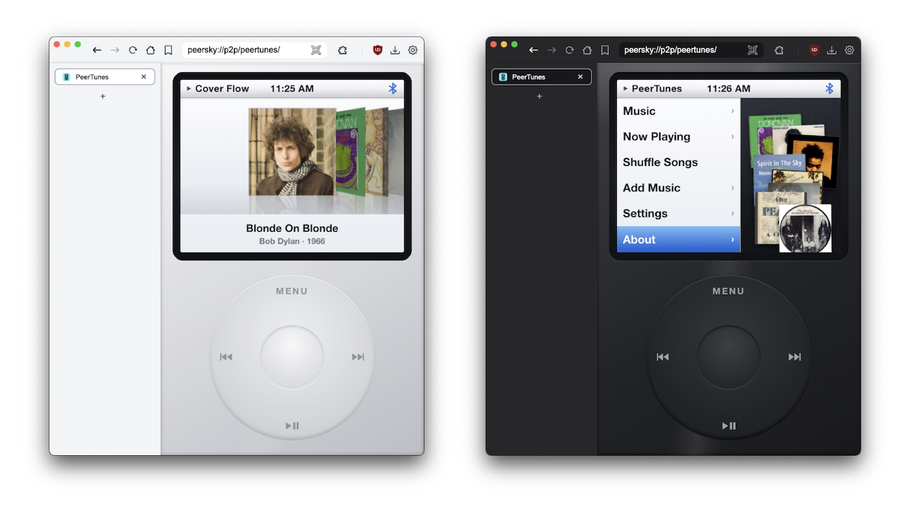

<p align="center">
  
</p>

<h1 align="center">PeerTunes</h1>

<p align="center">A p2p iPod for your local music. One static page, no build, no server, no tracking.<br>Made for <a href="https://github.com/p2plabsxyz/peersky-browser">PeerSky Browser</a>, works in any modern browser too.</p>

## What it does

- Loads music from a `hyper://` drive folder, an `ipfs://` folder, a plain http folder listing, or a direct audio link
- Upload a folder (or drag and drop it on the page) and it syncs into the library
- Reads tags right from the files: MP3 (ID3v2.2/2.3/2.4 and ID3v1), FLAC, M4A, OGG/Opus, WAV. Any normally tagged song works, embedded covers included
- Shows a default cover when a song has none
- Albums open in Cover Flow. Spin the wheel and the covers flip in 3D, like the good old days
- Artists, Songs and Genres as classic lists, sorted like an iPod would
- Custom playlists, with the On-The-Go gesture: hold the center button on a song to file it away
- Share a playlist as a `peersky://p2p/peertunes` link. It publishes to a hyper:// drive and the other side chooses Import or Play Only, so it never messes up their library
- The library lives in IndexedDB, so your songs stay on the device between visits
- A refresh brings back the exact page you were on
- Media Session support: lock your phone and the song keeps playing, with cover art and controls on the lock screen
- Click wheel with the classic clicker sound and a small vibration on phones
- Bluetooth mark in the status bar when the sound goes out over bluetooth headphones

Want to download your cloud songs playlist and own it locally? Use [zipify-tunes](https://github.com/akhileshthite/zipify-tunes). It turns a playlist into MP3s with ID3 tags and square cover art embedded, so everything shows up in PeerTunes with proper titles, albums and covers.

## How to use

Open `index.html`. It also works straight from `file://`, no server needed. On desktop the iPod scales with your window. On a phone it fills the whole screen.

The wheel works like the real one:

- Drag your finger (or mouse) in circles on the wheel to scroll, every step clicks
- Tap the center button to select
- MENU goes back, the bottom button is play and pause, left and right are previous and next
- On the Now Playing screen, scrolling changes the volume. Press center to switch to scrubbing, scroll to seek, press center again to leave
- In Cover Flow you can also swipe sideways or tap a side cover
- Keyboard also works: arrows, Enter, Escape, Space

To add music, go to `Add Music`:

- `Open URL…` and paste a `hyper://` folder that has your songs
- `Upload Folder…` to pick a folder from your device
- Or just drop files or a folder anywhere on the page

## Playlists

`Music -> Playlists` to make your own mixtapes. Hold the center button on any song (or long press it on the screen) for the old On-The-Go move: pick a playlist or make a new one right there. Inside a playlist you can add songs with checkmarks, remove one by holding it, share it, or delete it. The songs always stay in your library.

## Share a playlist

`Share Playlist…` inside a playlist (or `Add Music -> Share Library…`) publishes the songs to a `hyper://` drive right from the app: local files get copied into the drive, already-remote songs are just listed. Then it copies a link like:

```
peersky://p2p/peertunes/#playlist=hyper%3A%2F%2FKEY%2Flate-night-drive%2F
```

The drive carries a small `playlist.json` with the name and the track order.

On the other end, opening the link in PeerSky asks before touching anything:

- `Play Only` streams the playlist once and leaves their library exactly as it was
- `Import` saves the songs and files them under a playlist with your name for it
- Opening the same link again just opens the playlist, no double imports

Publishing needs PeerSky (that is where the drive writes live). Outside PeerSky you can still share folders you synced from a URL. The app accepts `#playlist=` or `?playlist=` (and old `src=` links) with `hyper://`, `ipfs://`, `ipns://` and http(s) sources.

## Loading from hyper://

PeerTunes lists the folder with a `fetch` and the `Accept: application/json` header, the way hypercore-fetch answers with a JSON array of entries. It walks subfolders, reads only the byte ranges it needs for tags (with Range requests), and streams the audio straight from the drive when you play. If the server answers with an html index page instead of JSON, it reads the links from that, so a plain `python -m http.server` folder works too.

## Publish it p2p

The whole app is static files with relative paths and plain scripts (no ES modules, so it runs from `file://` and older engines too). Put this folder in a hyperdrive and share the `hyper://` link, or ship it as a PeerSky p2p app at `peersky://p2p/peertunes/`. Your music folder can live in a second drive, then anyone with the share link has your mixtape and the player.

## Dev

No dependencies, no bundler:

- `js/metadata.js` tag parsers over a chunked reader (small ranged reads for remote files)
- `js/library.js` IndexedDB library, folder scan, url crawl
- `js/player.js` queue, shuffle, repeat, Media Session
- `js/wheel.js` click wheel input and the clicker sound (WebAudio, synthesized)
- `js/ui.js` screens, lists, Cover Flow, now playing
- `js/main.js` boot and wiring
- `assets/` icons (`icons.js`, kept as strings so glyphs can follow the shell theme), default cover, grain texture. The favicon comes from `peersky://static/assets/peertunes.ico` inside PeerSky

Console API for scripting: `PeerTunes.addUrl("hyper://…")`, `PeerTunes.addFiles([...])`, `PeerTunes.player`, `PeerTunes.library`.

To try it against a plain folder of songs without a p2p node, serve any music folder over http and load its URL from Add Music:

```bash
python3 -m http.server 8641
```

### Tests

```bash
node --test "test/*.test.js"
```

## License

MIT
